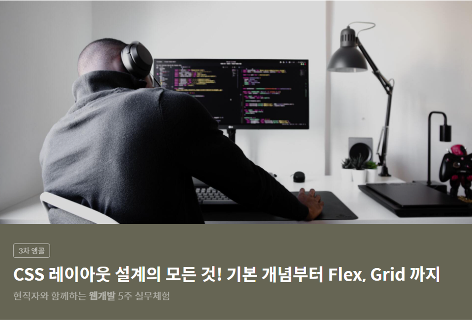
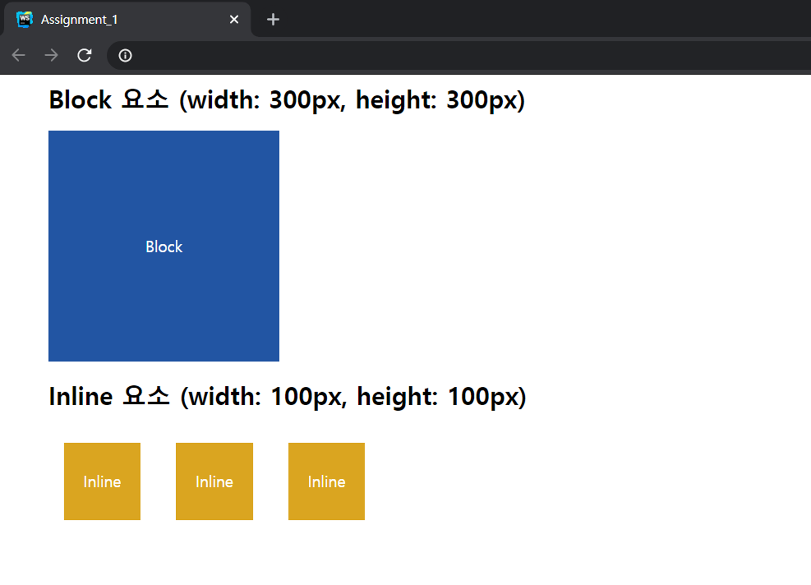
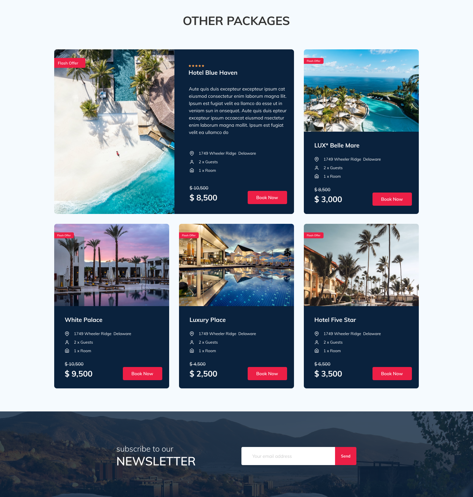

##### Table of Contents
- [코멘토 부트캠프 활동](#코멘토-부트캠프-활동)
  * [참여한 프로그램](#참여한-프로그램)
  * [학습 순서](#학습-순서)

# 코멘토 부트캠프 활동

## 참여한 프로그램

### [CSS 레이아웃 설계의 모든 것! 기본 개념부터 Flex, Grid까지]

- 웹 구성의 기초인 레이아웃 구조를 설계하는 작업을 학습

## 학습 순서

1. 박스 모델 학습

2. IE 10이하의 구형 브라우저에서 레이아웃을 잡을 떄 사용하는 float속성 학습
3. 모던 브라우저 환경에서 레이아웃 설계 시 사용되는 Flex와 Grid 학습

